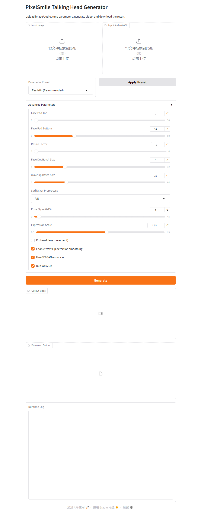

# PixelSmile AI Talking Head Pipeline

## UI 预览



## 项目简介

这是一个在本地运行的数字人视频生成管线，核心流程为：

1. 输入人像图片 + 音频（WAV）
2. SadTalker 生成人脸驱动视频
3. （可选）Wav2Lip 做口型增强
4. 输出最终视频文件

---

## 当前能力

- Gradio 可视化界面（上传、调参、生成、下载）
- 多组参数预设（推荐 / Kaggle-like / 稳定头部）
- 支持 SadTalker + GFPGAN 增强
- 支持切换是否启用 Wav2Lip
- 全流程在项目目录内运行（D 盘）

---

## 目录结构

```text
ai_video_pipeline/
├─ app.py                 # Gradio 界面入口
├─ run.py                 # 推理主流程
├─ run_pipeline.bat       # Windows 启动脚本
├─ inputs/                # 输入文件目录
├─ outputs/               # 输出文件目录
│  └─ sadtalker_runs/     # SadTalker 中间结果
├─ sadtalker/             # SadTalker 代码与模型目录
├─ Wav2Lip/               # Wav2Lip 代码与模型目录
├─ UI.png                 # 界面截图
└─ README.md
```

---

## 环境要求

- Windows
- Python 3.10（建议 Conda 环境）
- NVIDIA GPU（已在 RTX 3070 测试）

---

## 安装

```bash
conda create -n pixel_ai python=3.10
conda activate pixel_ai
pip install -r requirements.txt
pip install gradio
```

---

## 使用方式

### 1) 启动界面

双击或命令行运行：

```bat
run_pipeline.bat
```

启动后访问：

- http://127.0.0.1:7860

### 2) 在界面中操作

1. 上传图片与 WAV 音频
2. 选择预设或手动调参
3. 点击 `Generate`
4. 在界面中预览并下载输出视频

---

## 模型说明

本仓库不直接附带全部大模型权重。请按对应项目说明下载并放置到：

- `sadtalker/checkpoints/`
- `Wav2Lip/checkpoints/`

---

## 说明

如果你看到异常报错，优先检查：

- 当前是否激活 `pixel_ai` 环境
- `gradio` 是否安装在该环境
- 输入文件是否为有效图片与 WAV 音频
- 模型权重是否齐全
